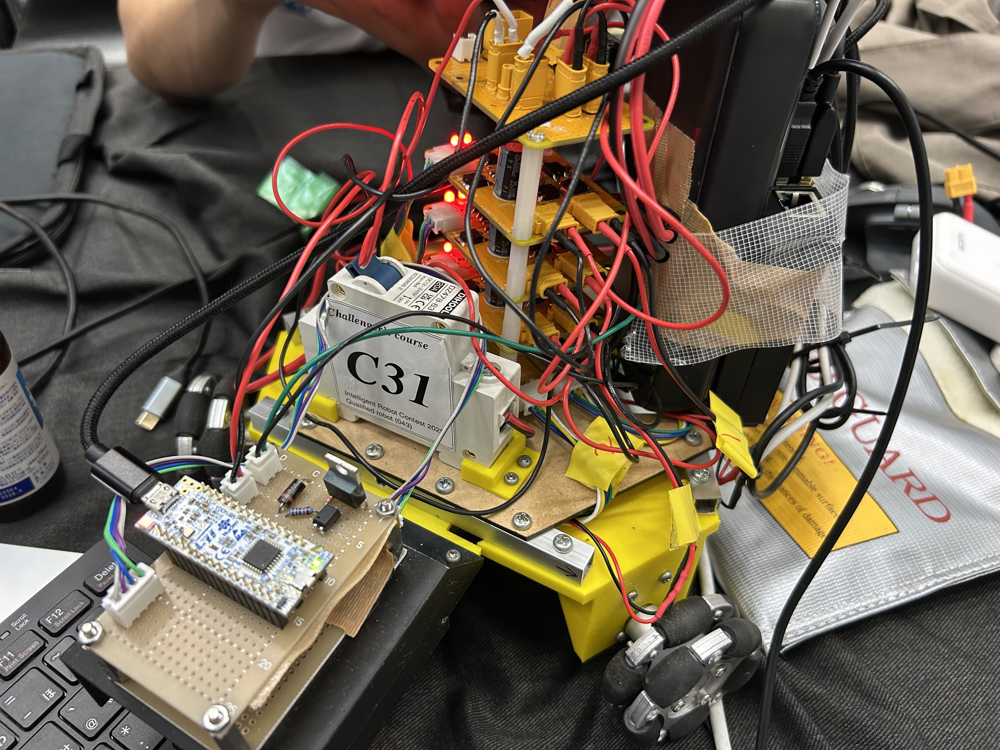

# T-semi 二郎部 やさろぼ

# Hardware


# 環境構築
## 実行に必要なライブラリ
- ros2 humble
- rosdep
- BehaviorTree
- gazebo

## あれば嬉しい
- Groot2
    - GUIでBehaivorTreeのシーケンスを組めるもの
    - たしかUbuntu限定（wslでもできるかも？）

### ros2 humble
[公式の手順](https://docs.ros.org/en/humble/Installation/Ubuntu-Install-Debs.html)にしたがってインストール
追加でこちらも実行
```bash
echo 'source /opt/ros/humble/setup.bash' >> ~/.bashrc
```


### rosdep
```bash
sudo apt-get install python3-rosdep
```
初期化と更新もしておく
```bash
sudo rosdep init
rosdep update
```

### colconのインストール
```bash
sudo apt install -y python3-colcon-common-extensions
```

### BaheaivorTreeのインストール
```bash
sudo apt install libzmq3-dev libboost-dev qtbase5-dev libqt5svg5-dev libzmq3-dev libdw-dev libnanoflann-dev
cd
git clone https://github.com/BehaviorTree/BehaviorTree.CPP.git
cd BehaviorTree.CPP
git checkout tags/4.7.0
mkdir build
cd build
cmake ..
make -j8
sudo make install
cd ros_ws
```

### CasiDAiのインストール
```bash
sudo apt install gfortran liblapack-dev pkg-config --install-recommends
sudo apt install swig
cd
git clone https://github.com/casadi/casadi.git -b main casadi
cd casadi
mkdir build
cd build
cmake -DWITH_PYTHON=ON -DWITH_IPOPT=ON -DWITH_OPENMP=ON -DWITH_THREAD=ON -DWITH_BUILD_REQUIRED=ON ..
make -j24
sudo make install
```

### gazeboのインストール
```bash
sudo apt-get install ros-${ROS_DISTRO}-ros-gz
```

### rosのworkspaceを作成
```bash
cd
mkdir -p ros_ws/src
```
各パッケージは`ros_ws/src/`においていきます

### ros2のパッケージのインストール
Lidarのパッケージと、プロセス間通信の型についてのパッケージがあるので、それぞれインストール
まずはLidarのパッケージ
```bash
cd
cd ros_ws/src
git clone git@github.com:keigo1216/ldrobot-lidar-ros2.git
cd ldrobot-lidar-ros2
git checkout humble
```

```bash
sudo apt install libudev-dev
sudo apt install libopencv-dev
```

```bash
cd ~/ros_ws/src/ldrobot-lidar-ros2/scripts/
./create_udev_rules.sh
```

次に型のパッケージ
```bash
cd
cd ros_ws/src
git clone git@github.com:keigo1216/inrof2025_ros_type.git
```

### メインのプログラムのインストール
このリポジトリのプログラムをインストールします
```bash
cd
cd ros_ws/src
git clone git@github.com:T-semi-Tohoku-Uni/yasarobo2025_26.git
```

## 環境設定
## 実機・シミュレーション共通の設定
エラー，warningは色をつける
```bash
echo 'export RCUTILS_COLORIZED_OUTPUT=1' >> ~/.bashrc
```

### シミュレーションで実行する場合
gazeboに表示するモデルのパスを設定
```bash
echo 'export IGN_GAZEBO_RESOURCE_PATH=~/ros_ws/src/yasarobo2025_26/models/' >> ~/.bashrc
```
`WITH_SIM`環境変数を`1`に設定（`0`にすると実機バージョンでビルドされるので注意）
```bash
echo 'export WITH_SIM=1' >> ~/.bashrc
``` 
GPUがついていないパソコンで実行する場合は、次のコマンドを実行
```bash
echo 'LIBGL_ALWAYS_SOFTWARE=1' >> ~/.bashrc
```

### 実機で実行する場合
手元のパソコンにrvizの出力などを表示させるために、ドメインやipを設定します（ラズパイ、手元のパソコンの両方で実行）
```bash
echo 'export ROS_DOMAIN_ID=1' >> ~/.bashrc
ros2 daemon stop
ros2 daemon start
```

`192.168.0.180`は、その機器のipアドレスに設定。（`ifconfig`を打てばわかる）
```bash
echo 'export ROS_IP=192.168.0.180' >> ~/.bashrc
```

sudoなしで，usbデバイスにアクセス
```bash
sudo usermod -a -G dialout $USER
```
デバッグ用のコントローラスティック
```bash
sudo apt install ros-humble-joy*
sudo usermod -a -G input $USER
```
ターミナルの再起動
```
exit
```

## 依存する外部ライブラリのインストール
```bash
rosdep install --from-paths src -y --ignore-src
```

## 実行方法
（初回のみ全てのパッケージをビルド）
```bash
cd
cd ros_ws
colcon build --symlink-install
```

ビルド
```bash
cd 
cd ros_ws
colcon build --packages-select yasarobo2025_26 --symlink-install
```
実行
```bash
source install/setup.bash
ros2 launch yasarobo2025_26 cpu_sim.launch.py
```

（もしグラボ付きのPCで実行する場合）
```bash
source install/setup.bash
ros2 launch yasarobo2025_26 gpu_sim.launch.py
```